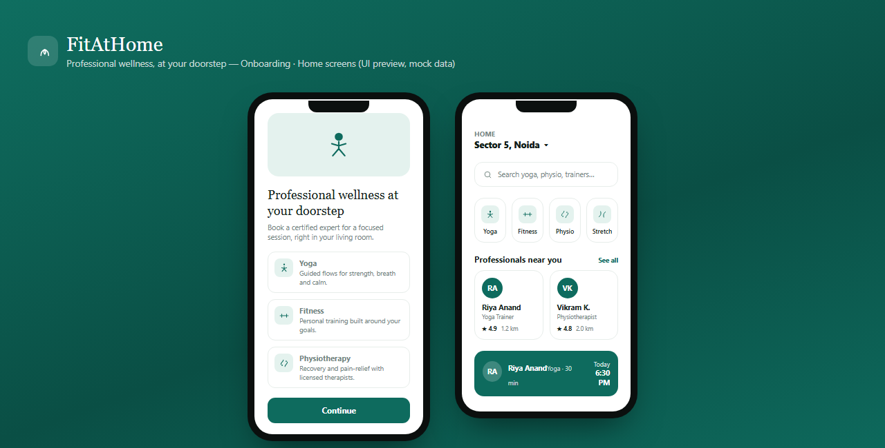

# FitAtHome

An on-demand home wellness booking app — book verified Yoga, Fitness, Physiotherapy, or Stretching & Mobility professionals for a 5, 10, 15, 30, or 60 minute session at your doorstep.



## Status

This is a **UI-only build with mock data** — no backend is wired up yet. It exists to validate the screens and flow before connecting Firebase.

- **User app** — Splash, Onboarding, Login, Home, Service Selection, Professional Profile, Booking, Booking Confirmation, My Bookings, Profile
- **Professional app** — Login, Dashboard, Bookings, Earnings, Profile
- **Admin panel** — Dashboard, Users, Professionals, Bookings, Services, Payments, Complaints

## Tech stack

- Flutter / Dart
- Firebase Authentication, Cloud Firestore, Firebase Storage *(planned — not yet integrated)*

## Running the app

```powershell
flutter pub get
flutter run -d chrome
```

The Professional and Admin experiences are reachable via two links on the Login screen, since role-based auth doesn't exist yet.
